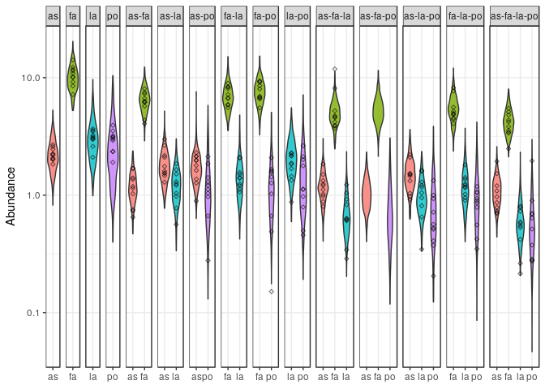
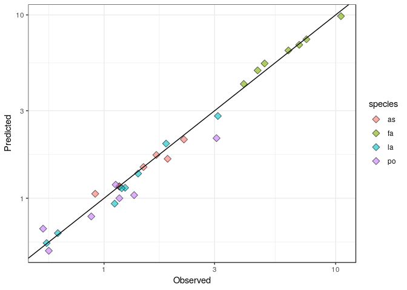
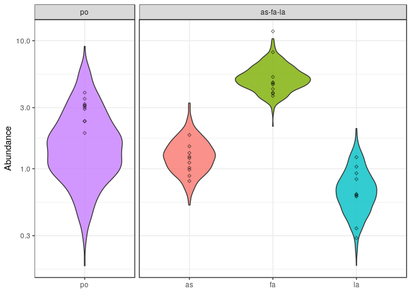
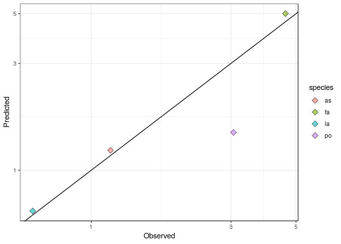

Fitting endpoints: Bayesian approach
================
Daniel Maynard, Zachary Miller and Stefano Allesina

Here we show how to fit the endpoints or predict out of fit using the Bayesian approach, as presented in the main text. This method accounts for log-normal measurement error in each endpoint abundance, and for the fact that each endpoint appears in multiple different equations. This method is the recommended approach for fitting this model, though it is computationally intensive.

All the code needed for the analysis is in the file `bayes.R`. The Bayesian MCMC algorithm is implemented in the Stan programming language, which is called here from within `R`. The details of model is given in `Stan_file.stan`, which instructs the MCMC sampler how to calculate the log-likelihood at each step. Please see `https://mc-stan.org/users/interfaces/` for instructions on installing Stan. In addition to Stan, the libraries `rstan`, `tidyverse`, and `coda` need to be installed for this code to run.

``` r
source("bayes.R")
```

### Step 1: label the data

First, call the function prepare\_data using one of the available data sets, or any other data set organized in the same manner. The data file should be in csv format, with one column for each species, and one row for each recorded endpoint. The header should specify the name of the species. For example:

``` r
dt <- read_csv("../../data/Kuebbing_plants/natives.csv")
dt %>% sample_n(10) # show 10 endpoints sampled at random
```

    ## # A tibble: 10 x 4
    ##       as    fa    la    po
    ##    <dbl> <dbl> <dbl> <dbl>
    ##  1 2.46  0     0      0   
    ##  2 0.390 3.17  0      3.27
    ##  3 1.32  2.50  0      0   
    ##  4 2.06  0     0      0   
    ##  5 1.00  0     0.604  2.90
    ##  6 0     4.32  1.43   0   
    ##  7 0.781 0.967 0.446  2.22
    ##  8 2.02  0     0      3.22
    ##  9 2.26  1.90  0.308  0   
    ## 10 0.592 2.06  0      3.05

The function prepare\_data simply adds a column containing a label for the community. For example:

``` r
dt <- prepare_data("~/Git/endpoints/github/data/Kuebbing_plants/invasives.csv")
dt %>% sample_n(10)
```

    ## # A tibble: 10 x 5
    ##       as    fa    la    po community  
    ##    <dbl> <dbl> <dbl> <dbl> <chr>      
    ##  1 0      9.35 0     2.09  fa-po      
    ##  2 2.01   0    0     0     as         
    ##  3 2.24   0    0     0     as         
    ##  4 1.79   0    0     1.12  as-po      
    ##  5 0      0    1.45  1.12  la-po      
    ##  6 0.699  3.42 0.215 1.96  as-fa-la-po
    ##  7 0.648  6.19 0     0     as-fa      
    ##  8 2.21   0    1.05  0.999 as-la-po   
    ##  9 1.03   0    1.30  0.374 as-la-po   
    ## 10 0.732  3.39 0.591 0.277 as-fa-la-po

### Step 2: fitting all endpoints

To use all of the available data to estimate *B* via a Bayesian approach, call the function `fit_stan`, which calls the `stan` function within R. The `fit_stan` function allows you to adjust several parameters:

-   `stan_file` gives the location of the Stan file used for fitting
-   `exclude` specifies which communities to exclude. If set to `NULL` (default) all endpoints are used. Otherwise it takes a character vector of communities, e.g., `c("fa","fa-po")`.
-   `B_upper` is a binary matrix of dimension *n* × *n* indicating the upper bounds on each entry of B. A matrix of all 1s would specify no upper bound for any element; a matrix with 1s on the off-diagonal and 0 on the diagonal would constrain the diagonal entries to be negative. The default is a purely competitive community (`B_upper = 0`)
-   `B_lower` is a binary matrix of dimension *n* × *n* indicating the lower bounds on each entry of B. A matrix of all −1s would specify no lower bound for any element; a matrix with −1s on the off-diagonal and 0 on the diagonal would constrain the diagonal entries to be positive. The defaults is no lower bound (`B_upper = -1`)
-   `chains` the number of mcmc chains to run
-   `cores` the number of processor cores to use
-   `iter` the number of MCMC iterations
-   `warmup` the number of warm-up iterations before sampling
-   `thin` the number of iterations to skip between samples
-   `seed` the random seem for the Stan function (default is `10`)

For example, here we fit two short chains (5000 iterations) to the full invasive plant data using two cores:

``` r
stan_results <- fit_stan(dt, stan_file = "Stan_file.stan", chains = 2, 
                   cores = 2, iter = 5000, warmup = 2000, thin = 15)
```

    ## [1] "fitting all endpoints"

#### Plotting diagnostics

The resulting output is a named list that contains the details of the fit (original data, excluded communities, number of iterations, etc.) as well as the MCMC results. For example, here are the first 10 iterations of the MCMC run, showing the first 4 coefficients (first column) of *B*:

``` r
as.matrix(stan_results$stan_fit)[1:10,1:4]
```

    ##           parameters
    ## iterations     B[1,1]     B[2,1]     B[3,1]     B[4,1]
    ##       [1,] -0.4538348 -0.2835567 -0.3201802 -0.3294600
    ##       [2,] -0.4465964 -0.2924835 -0.3275420 -0.2992859
    ##       [3,] -0.4260008 -0.2662578 -0.3090865 -0.2884263
    ##       [4,] -0.4493458 -0.2865314 -0.3308038 -0.3176141
    ##       [5,] -0.4730513 -0.2838069 -0.3370264 -0.3344845
    ##       [6,] -0.4928515 -0.2562541 -0.3324371 -0.3159799
    ##       [7,] -0.5264155 -0.3314866 -0.3587454 -0.3370532
    ##       [8,] -0.5246959 -0.2860623 -0.3250148 -0.2951149
    ##       [9,] -0.4743201 -0.2891395 -0.3511693 -0.3337661
    ##      [10,] -0.4513145 -0.2758522 -0.3158761 -0.3125297

From this output, we can plot diagnostics by calling the `plot_diagnostics` function, specifying either histogram of *B* (`show_plot = "hist"`) or the full MCMC output across all iterations (`show_plot = "chains"`), or both. For example, here's the histogram of the posterior of *B*:

``` r
plot_diagnostics(stan_results, show_plot = "hist") 
```

    ## [1] "Plotting histogram of B"

    ## `stat_bin()` using `bins = 30`. Pick better value with `binwidth`.


### Step 3: predicting endpoints

To predict the endpoint abundance for a specific subset of species *s*, we take a bootstrap sample from the posterior of *B* and *σ*, subset the matrix *B* by taking the rows and columns corresponding to *s*, and calculate the negative row sum of this sub-matrix *B*<sub>*s*</sub>, yielding an estimate of *x*<sup>(*s*)</sup>. To estimate the prediction interval, which takes into account the error, we can sample this endpoint abundance from a log-normal distribution, with standard deviation of *σ*<sub>*s*</sub>.

This process is implemented in the `boostrap_results` function, which takes the previous `stan_results` list, along with a specified number of bootstrap samples, here set to 500:

``` r
br <- bootstrap_results(stan_results, nboot=500)
```

    ## [1] "Bootstrapping community 1 of 15"
    ## [1] "Bootstrapping community 2 of 15"
    ## [1] "Bootstrapping community 3 of 15"
    ## [1] "Bootstrapping community 4 of 15"
    ## [1] "Bootstrapping community 5 of 15"
    ## [1] "Bootstrapping community 6 of 15"
    ## [1] "Bootstrapping community 7 of 15"
    ## [1] "Bootstrapping community 8 of 15"
    ## [1] "Bootstrapping community 9 of 15"
    ## [1] "Bootstrapping community 10 of 15"
    ## [1] "Bootstrapping community 11 of 15"
    ## [1] "Bootstrapping community 12 of 15"
    ## [1] "Bootstrapping community 13 of 15"
    ## [1] "Bootstrapping community 14 of 15"
    ## [1] "Bootstrapping community 15 of 15"

From this, we can plot the results using the `plot_boot_results` function, either specifying the observed vs. predicted plot (`show_plot = "obs_pred"`) or the violin plots of the prediction intervals (`show_plot = "violin"`), or both:

``` r
pl <- plot_boot_results(br, show_plot = "both")
```

    ## [1] "Plotting violin plots"



    ## [1] "Plotting observed vs. pred"



If no communities were excluded from the fitting process, this function will plot all the posterior prediction interval of all communities (including unobserved communities, for example, `as-la-po`, above).

### Step 4: predicting out-of-fit

We can repeat this above analysis, but with the removal of one or more communities to test the out-of-fit predictions. To do this, we specify which communities to exclude by listing as a character vector when we call `fit_stan`. Importantly, this function performs a check on the endpoint matrix: if we exclude too many communities, or if the original endpoint matrix contain an insufficient number of endpoints to fit *B*, then this function will return an error before calling Stan. Here, for example, we exclude too many communities, such that species `as` and `fa` never occur together:

``` r
stan_reduced <- fit_stan(dt, exclude = c("as-fa","as-fa-la","as-fa-la-po"),
                         stan_file = "Stan_file.stan", chains = 2, cores = 2, iter = 5000, 
                         warmup = 2000, thin = 15, seed=12)
```

    ## [1] "excluding communities as-fa, as-fa-la, as-fa-la-po"

    ## Error in check_endpoints(E): Not enough endpoint to fit

Otherwise, provided there are enough endpoints, the specified communities are removed from the dataset, and the Stan file is implemented on the reduced data:

``` r
stan_reduced <- fit_stan(dt, exclude = c("po","as-fa-la"),
                         stan_file = "Stan_file.stan", chains = 2, cores = 2, iter = 5000, 
                         warmup = 2000, thin = 15, seed=12)
```

    ## [1] "excluding communities po, as-fa-la"

After bootstrapping these results, the `plot_boot_results` function plots the predictions for the omitted communities:

``` r
br_reduced <- bootstrap_results(stan_reduced, nboot=500)
```

    ## [1] "Bootstrapping community 1 of 2"
    ## [1] "Bootstrapping community 2 of 2"

``` r
pl_reduced <- plot_boot_results(br_reduced, show_plot = "both")
```

    ## [1] "Plotting violin plots"



    ## [1] "Plotting observed vs. pred"


