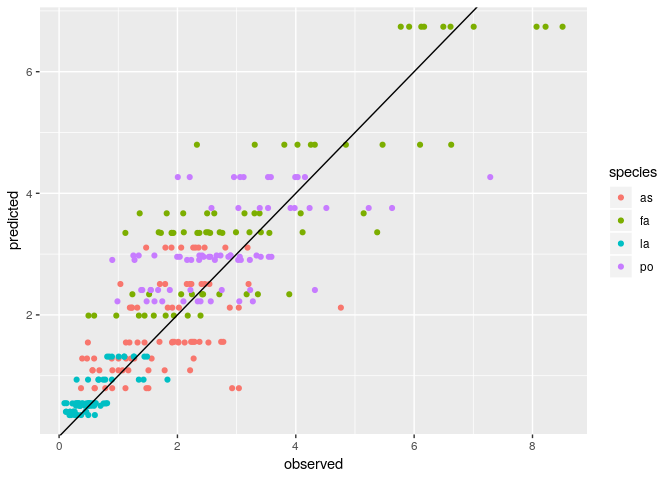
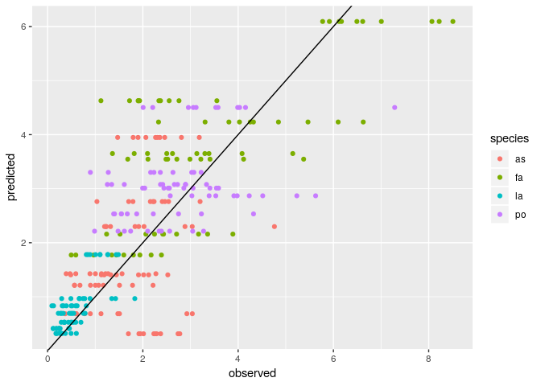
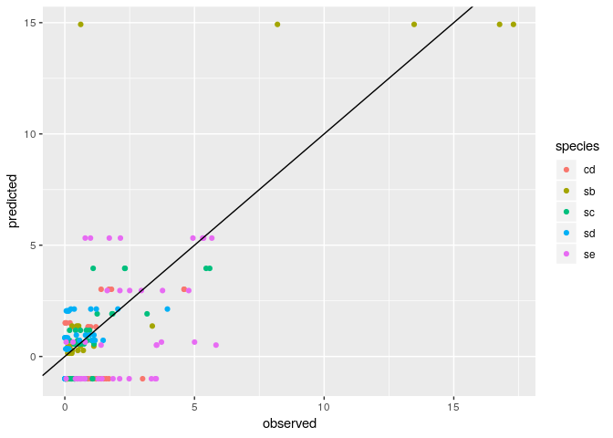
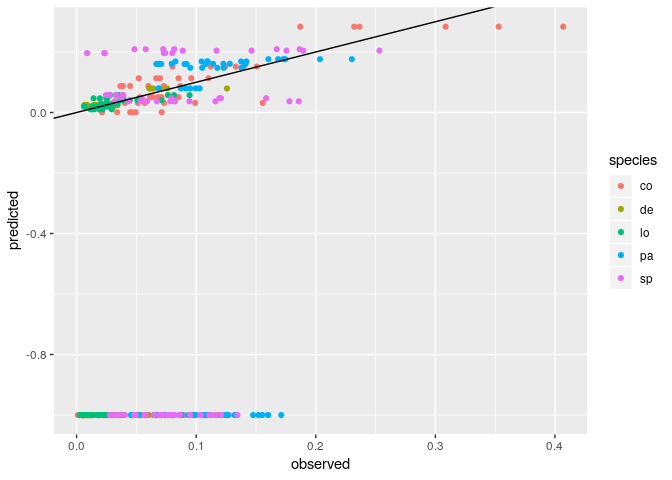

Fitting endpoints: naive approach
================
Daniel Maynard, Zachary Miller and Stefano Allesina

Here we show how to fit the endpoints or predict them out-of-fit using the naive approach presented in the Materials and Methods. The approach is similar to a linear regression. The advantage of this method is that it is quite fast, and it allows to understand the mechanics of the model very well. The downside is that it can return nonsensical solutions (e.g., negative abundances) if the data deviate from what expected.

All the code needed for the analysis is contained in the file `naive.R`. The libraries `MASS` and `tidyverse` need to be installed for the code to run.

``` r
# requires libraries tidyverse and MASS
source("naive.R")
```

### Step 1: label the data

First, call the function `prepare_data` using one of the available data sets, or any other data set organized in the same manner. The data file should be in `csv` format, with one column for each species, and one row for each recorded endpoint. The header should specify the name of the species. For example:

``` r
dt <- read_csv("../../data/Kuebbing_plants/natives.csv")
dt %>% sample_n(10) # show 10 endpoints sampled at random
```

    ## # A tibble: 10 x 4
    ##       as    fa    la    po
    ##    <dbl> <dbl> <dbl> <dbl>
    ##  1 2.88   3.13 0     0    
    ##  2 2.36   0    0     0    
    ##  3 1.22   2.62 0     0    
    ##  4 0      0    0.457 4.23 
    ##  5 1.00   2.43 0     0.986
    ##  6 1.27   2.24 0     2.10 
    ##  7 0      0    0.292 5.63 
    ##  8 2.06   0    0     0    
    ##  9 0.390  3.17 0     3.27 
    ## 10 1.04   0    0.437 0

The function `prepare_data` simply adds a column containing a label for the community. For example:

``` r
dt <- prepare_data("../../data/Kuebbing_plants/natives.csv")
dt %>% sample_n(10) # show 10 endpoints sampled at random
```

    ## # A tibble: 10 x 5
    ##       as    fa    la    po community  
    ##    <dbl> <dbl> <dbl> <dbl> <chr>      
    ##  1 1.47   0    0      0    as         
    ##  2 0      4.11 0      3.54 fa-po      
    ##  3 0      6.12 0      0    fa         
    ##  4 1.79   0    0.498  0    as-la      
    ##  5 0      0    0.848  0    la         
    ##  6 2.74   1.72 0.621  0    as-fa-la   
    ##  7 0.602  1.94 0.182  2.75 as-fa-la-po
    ##  8 1.70   0    0.496  0    as-la      
    ##  9 1.84   3.30 0      0    as-fa      
    ## 10 1.32   2.50 0      0    as-fa

### Step 2: fitting all endpoints

To use all of the available data to parameterize the matrix *B*, simply call:

``` r
out <- fit_endpoints(dt)
```

The function returns a list, containing the best-fitting matrix *B*:

``` r
out$B
```

    ##            [,1]        [,2]       [,3]       [,4]
    ## [1,] -0.3218798 -0.08661629 -0.3816623 -0.1730324
    ## [2,] -0.2149084 -0.14837835 -0.3080815 -0.1697552
    ## [3,] -0.2454120 -0.06011190 -0.7612364 -0.1560388
    ## [4,] -0.2066253 -0.09150894 -0.2194261 -0.2343866

And a tibble containing, for each community, the observed vs. fitted values:

``` r
out$results
```

    ## # A tibble: 289 x 4
    ##    community species observed predicted
    ##    <chr>     <chr>      <dbl>     <dbl>
    ##  1 as        as          1.47      3.11
    ##  2 as        as          1.80      3.11
    ##  3 as        as          1.90      3.11
    ##  4 as        as          2.06      3.11
    ##  5 as        as          2.27      3.11
    ##  6 as        as          2.31      3.11
    ##  7 as        as          2.36      3.11
    ##  8 as        as          2.46      3.11
    ##  9 as        as          2.81      3.11
    ## 10 as        as          3.18      3.11
    ## # ... with 279 more rows

The results can be visualized using:

``` r
stats_and_plot_results(out$results)
```

    ## [1] "Correlation"
    ## [1] 0.8600766



### Step 3: predicting out of fit

The function `predict_out_of_fit` implements the out-of-fit prediction scheme presented in the manuscript. In turn, each endpoint (and all its replicates) is removed, and the remaining data are used to predict the coexistence abundance of the species at the removed endpoint. Negative abundances should be interpreted as lack of coexistence for the community (the program sets all abundances to -1 in this case).

For example:

``` r
loo <- predict_out_of_fit(dt)
stats_and_plot_results(loo)
```

    ## [1] "Correlation"
    ## [1] 0.7607995



### Poor performance of naive approach

While the results are good for the data by Kuebbing *et al.* (2015), presented above, the other data sets show that this approach cannot successfully predict the endpoints. For example:

``` r
# in-fit Rakowski and Cardinale (2016)
dtrc <- prepare_data("../../data/Rakowski_daphnia/cd_algae.csv")
out <- fit_endpoints(dtrc)
stats_and_plot_results(out$results) 
```

    ## [1] "Correlation"
    ## [1] 0.7291944



Where several communities that were observed experimentally are predicted to collapse. Similar problems are found when using the data from Pennekamp *et al.* (2018):

``` r
# in-fit Pennekamp et al. 2018
dtp <- prepare_data("../../data/Pennekamp_protists/temp_17.csv")
out <- fit_endpoints(dtp)
stats_and_plot_results(out$results) 
```

    ## [1] "Correlation"
    ## [1] 0.2783566


