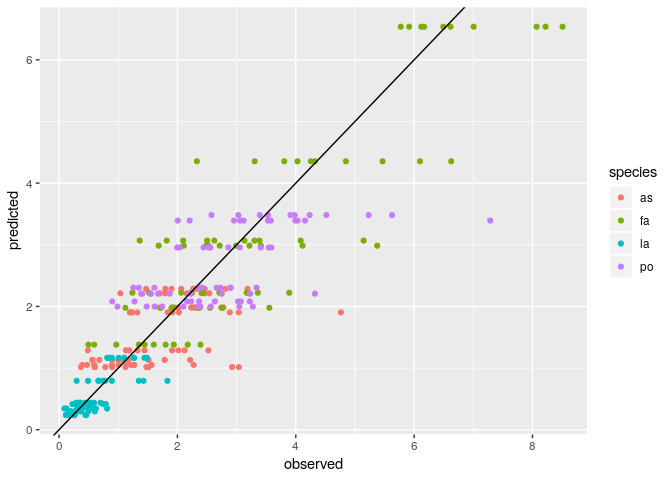
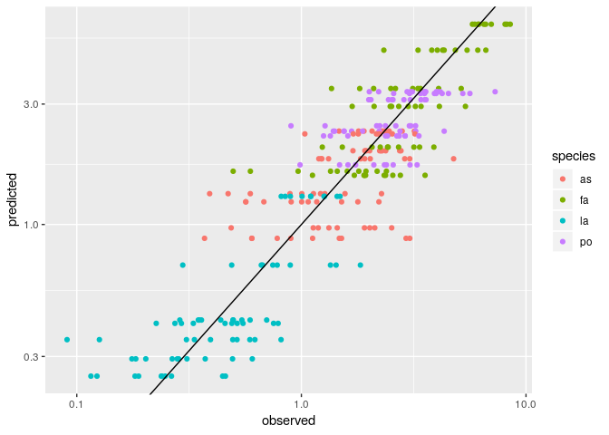
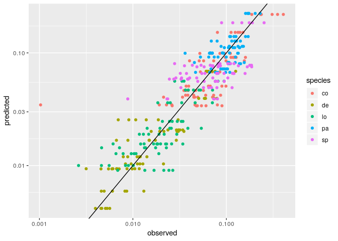
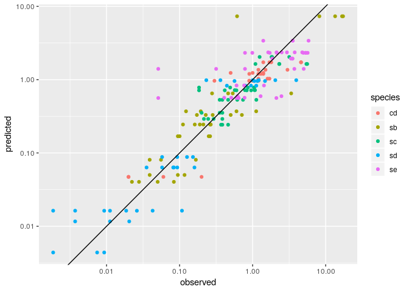

Fitting endpoints: sum-of-squares approach
================
Daniel Maynard, Zachary Miller and Stefano Allesina

Here we show how to fit the endpoints or predict them out-of-fit using the sum-of-square approach presented in the Materials and Methods. The approach is based on numerical optimization. It can account for different error structures (i.e., observed values sampled from a Normal or Log-Normal distribution), and is considerably faster than the Bayesian approach that uses MCMC to construct a posterior distribution. The downside is that numerical optimization requires a good initial guess of the matrix *B* to converge to a global minimum, and that there could be many parameterizations that are "local minima", making the search hard. Moreover, it only return point estimates (vs. a distribution in the Bayesian approach).

All the code needed for the analysis is contained in the file `ssq.R`. The library `tidyverse` needs to be installed for the code to run.

``` r
# requires library tidyverse
source("ssq.R")
```

### Step 1: label the data

First, call the function `prepare_data` using one of the available data sets, or any other data set organized in the same manner. The data file should be in `csv` format, with one column for each species, and one row for each recorded endpoint. The header should specify the name of the species. For example:

``` r
dt <- read_csv("../../data/Kuebbing_plants/natives.csv")
dt %>% sample_n(10) # show 10 endpoints sampled at random
```

    ## # A tibble: 10 x 4
    ##       as    fa    la    po
    ##    <dbl> <dbl> <dbl> <dbl>
    ##  1  0     0    0.788  3.03
    ##  2  2.06  0    0      0   
    ##  3  2.26  1.90 0.308  0   
    ##  4  0     0    1.49   0   
    ##  5  0     0    0.274  3.39
    ##  6  0     0    0.490  3.53
    ##  7  3.18  0    0      0   
    ##  8  2.36  0    0      0   
    ##  9  1.04  0    0.437  0   
    ## 10  0     4.11 0      3.54

The function `prepare_data` simply adds a column containing a label for the community. For example:

``` r
dt <- prepare_data("../../data/Kuebbing_plants/natives.csv")
dt %>% sample_n(10) # show 10 endpoints sampled at random
```

    ## # A tibble: 10 x 5
    ##       as    fa    la    po community
    ##    <dbl> <dbl> <dbl> <dbl> <chr>    
    ##  1 0      8.51 0     0     fa       
    ##  2 0      0    0     4.15  po       
    ##  3 0      0    0.274 3.39  la-po    
    ##  4 1.13   0    0     0.899 as-po    
    ##  5 0      0    0.752 5.23  la-po    
    ##  6 1.19   0    0     2.23  as-po    
    ##  7 0      0    1.01  0     la       
    ##  8 0      6.63 0.490 0     fa-la    
    ##  9 0.565  0    0.494 2.42  as-la-po 
    ## 10 0      2.49 0     3.05  fa-po

### Step 2: fitting all endpoints

To use all of the available data to parameterize the matrix *B*, call the function `fit_endpoints`. The function allows to adjust several parameters:

-   `use_logs = FALSE` if set to `TRUE`, compute the SSQ using the log of the observed and predicted abundances
-   `initial_matrix = NULL` if specified, use the matrix to start the numerical search (needs to be of size *n* × *n*, where *n* is the number of species in the system)
-   `method = "BFGS"` method to use for the numerical optimization (using `optim`; for example, `method = "Nelder-Mead"`)
-   `num_steps = 5000` maximum number of iterations for the `optim` function
-   `show_progress = FALSE` track the progress of the optimization routine

For example,

``` r
out <- fit_endpoints(dt, use_logs = TRUE, show_progress = TRUE)
```

The function returns a list, containing the best-fitting matrix *B*:

``` r
out$B
```

    ##            [,1]        [,2]       [,3]       [,4]
    ## [1,] -0.4376353 -0.05445627 -0.0721136 -0.2098196
    ## [2,] -0.2788497 -0.15297676 -0.4207948 -0.1837540
    ## [3,] -0.2824353 -0.07335484 -0.8577843 -0.1847625
    ## [4,] -0.3003352 -0.04304214  0.0633261 -0.2947655

And a tibble containing, for each community, the observed vs. fitted values:

``` r
out$results
```

    ## # A tibble: 289 x 4
    ##    community species observed predicted
    ##    <chr>     <chr>      <dbl>     <dbl>
    ##  1 as        as          1.47      2.29
    ##  2 as        as          1.80      2.29
    ##  3 as        as          1.90      2.29
    ##  4 as        as          2.06      2.29
    ##  5 as        as          2.27      2.29
    ##  6 as        as          2.31      2.29
    ##  7 as        as          2.36      2.29
    ##  8 as        as          2.46      2.29
    ##  9 as        as          2.81      2.29
    ## 10 as        as          3.18      2.29
    ## # ... with 279 more rows

The results can be visualized using:

``` r
stats_and_plot_results(out$results)
```

    ## [1] "Correlation"
    ## [1] 0.8854993



Note that the matrix *B* obtained in the manner can be fed back to the function, to further refine the results. For example

``` r
out <- fit_endpoints(dt, use_logs = TRUE, method = "Nelder-Mead", initial_matrix = out$B)
```

    ## [1] "initial B"
    ##            [,1]        [,2]       [,3]       [,4]
    ## [1,] -0.4376353 -0.05445627 -0.0721136 -0.2098196
    ## [2,] -0.2788497 -0.15297676 -0.4207948 -0.1837540
    ## [3,] -0.2824353 -0.07335484 -0.8577843 -0.1847625
    ## [4,] -0.3003352 -0.04304214  0.0633261 -0.2947655
    ## [1] "initial SSQ"
    ## [1] 43.81022
    ## [1] "final B"
    ##            [,1]        [,2]        [,3]       [,4]
    ## [1,] -0.4375914 -0.05447747 -0.07229258 -0.2098808
    ## [2,] -0.2788683 -0.15296921 -0.42081826 -0.1838126
    ## [3,] -0.2824423 -0.07342234 -0.85754328 -0.1848188
    ## [4,] -0.3004534 -0.04311545  0.06292675 -0.2947083
    ## [1] "final SSQ"
    ## [1] 43.81021

### Step 3: predicting out of fit

The function `predict_out_of_fit` implements the out-of-fit prediction scheme presented in the manuscript. In turn, each endpoint (and all its replicates) is removed, and the remaining data are used to predict the coexistence abundance of the species at the removed endpoint. Negative abundances should be interpreted as lack of coexistence for the community (the program sets all abundances to -1 in this case). **Note:** This function can take a very long time to run, as the optimization is repeated once for each endpoint.

For example:

``` r
loo <- predict_out_of_fit(dt, use_logs = TRUE)
```

``` r
stats_and_plot_results(loo) + scale_x_log10() + scale_y_log10()
```

    ## [1] "Correlation"
    ## [1] 0.8665487



### Better performance than naive approach

Compared to the naive approach, we are now able to fit the data much better. For example, using the data from Pennekamp *et al.* (2018):

``` r
# in-fit Pennekamp et al. 2018
dtp <- prepare_data("../../data/Pennekamp_protists/temp_17.csv")
out <- fit_endpoints(dtp, use_logs = TRUE)
stats_and_plot_results(out$results) + scale_x_log10() + scale_y_log10()
```

    ## [1] "Correlation"
    ## [1] 0.8518468



We see that we were able to find a solution that is compatible with all observed endpoints (while the naive method resulted in the lack of coexistence for several communities that were observed experimentally).

To show how the starting matrix can be initialized, we consider the data of Rakowski and Cardinale (2016), where the first species is a consumer (and therefore we expect a corresponding positive diagonal term). We write a simple function to build the matrix that we're going to use as a starting point:

``` r
build_init <- function(n, consumer, diagc = 0.5, diagp = -1, pp = -0.5, cc = 0, cp = -2, pc = -0.2){
  B <- matrix(pp, n, n)
  diag(B)[consumer] <- diagc
  diag(B)[!consumer] <- diagp
  B[consumer, !consumer] <- cp
  B[!consumer, consumer] <- pc
  return(B)
}
```

And then call the optimization function repeatedly, to refine our fitted matrix *B*:

``` r
drc <- prepare_data("../../data/Rakowski_daphnia/cd_algae.csv")
# start with positive diagonal for consumers
out <- fit_endpoints(drc, use_logs = TRUE, initial_matrix = build_init(5, c(T, F, F, F, F)), 
                     method = "Nelder-Mead", show_progress = TRUE, num_steps = 10000)
# refine the solution to obtain a better fit
out2 <- fit_endpoints(drc, use_logs = TRUE, initial_matrix = out$B, 
                     method = "Nelder-Mead", show_progress = TRUE, num_steps = 10000)
out3 <- fit_endpoints(drc, use_logs = TRUE, initial_matrix = out2$B, 
                     show_progress = TRUE, num_steps = 10000)
```

Note the positive diagonal for the consumer (`cd`, first row/col):

``` r
out3$B
```

    ##            [,1]       [,2]       [,3]       [,4]       [,5]
    ## [1,]  0.9018792 -7.7480655 -2.3950243 -1.0879858 -1.9049492
    ## [2,] -0.5533206 -0.1364913 -0.5820407  0.3333291 -0.2880722
    ## [3,] -0.5416487  1.1991870 -0.6111036 -0.6430820 -0.3938227
    ## [4,] -0.5469010  1.4505196 -0.5395327 -1.0166574 -0.4259649
    ## [5,] -0.5451922  1.3407626 -0.5448712 -0.3706996 -0.4307501

And the better fit to the data:

``` r
stats_and_plot_results(out3$results) + scale_x_log10() + scale_y_log10()
```

    ## [1] "Correlation"
    ## [1] 0.8150536


